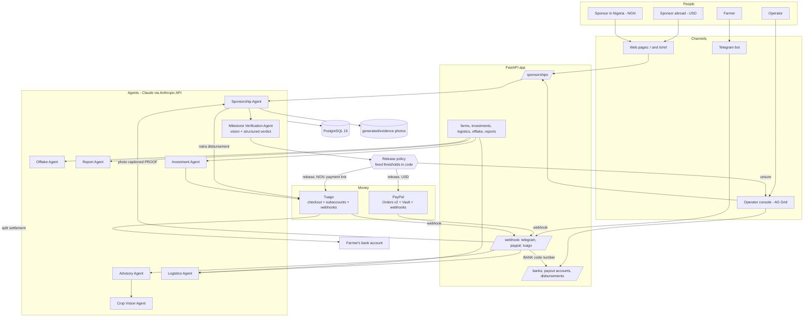

# Yieldra Architecture

> Sponsor a farm. Pay as it grows.

## System overview

## Two rails, one flow

| | PayPal (USD) | Tuago (NGN) |
|---|---|---|
| First tranche | Order approved by the sponsor, captured on return or by webhook | Checkout paid by bank transfer |
| Later tranches | Charged to the saved PayPal account when the photo passes | A new checkout is sent to the sponsor when the photo passes |
| Tranche states | `awaiting_evidence → paid` (or `payment_failed`) | `awaiting_evidence → awaiting_payment → paid` |
| Farmer is paid by | A disbursement Yieldra funds through Tuago | The sponsor's payment itself, via the farmer's subaccount |
| On completion or cancel | Saved PayPal account is deleted | Nothing further is requested |

## Sponsorship flow

1. `POST /sponsorships/checkout` (web) or `POST /sponsorships` → **Sponsorship Agent**
   plans four tranches for the farm's crop and creates the first payment.
2. The first payment is confirmed: PayPal by `GET /sponsorships/paypal/return` or the
   `CHECKOUT.ORDER.APPROVED` webhook; Tuago by its `charge.success` webhook or the
   sponsor's page re-checking on return.
3. The farmer sends a photo captioned `PROOF`. It is downloaded, fingerprinted,
   checked against earlier photos, and a copy is stored.
4. **Milestone Verification Agent** receives the photo and the stage's evidence
   requirement and must answer through a forced tool call:
   `shows_farm_scene`, `crop_matches`, `milestone_met`, `confidence`, `observations`,
   `concerns`.
5. **Release policy** (`decide`) turns the verdict into `release`, `review` or `reject`.
6. On `release` the tranche is collected on its rail and the next stage opens.

### Why the model cannot move money

The Milestone Verification Agent has no payment tool. It returns a verdict; plain
code compares it with `MILESTONE_RELEASE_CONFIDENCE` and `MILESTONE_REVIEW_CONFIDENCE`.
The photo's caption is never sent to the model, and the system prompt tells it to
treat writing inside a photo as scenery. Payment links are appended by code, never
written by the model.

## Farmer payouts

Tuago has no API for sending money. Third parties are paid by *split settlement*.

1. The farmer registers a bank account (`BANK <code> <number>` by chat, or the
   console). Yieldra creates a Tuago subaccount; Tuago verifies the account name.
2. Naira tranches are Tuago checkouts created with `subaccount`, so the farmer's
   share settles to their bank when the sponsor pays.
3. Each paid PayPal tranche creates a `FarmerDisbursement`: the dollar amount at
   `USD_NGN_RATE`, as a Tuago checkout routed to the farmer's subaccount. The console
   shows the account to transfer into. When Tuago confirms the transfer the
   disbursement is `paid` and the farmer is told.

If the farmer has no bank account yet the disbursement waits in
`needs_bank_details` and opens as soon as they add one.

## Payment safety

| Concern | Mechanism |
|---|---|
| Retry or crash mid-charge | `PayPal-Request-Id` built from sponsorship reference + tranche + attempt |
| PayPal refused the charge | Tranche marked `payment_failed`; retry uses the next attempt number |
| No answer from PayPal | Tranche marked `payment_failed`; retry reuses the same key |
| Forged webhook | Tuago: HMAC-SHA512 of the raw body. PayPal: verified with PayPal's API |
| Genuine webhook, wrong facts | Status and amount are re-read from the provider before marking paid |
| Capture or payment differs from the amount asked | Not marked paid |
| Messaging or model failure after a payment | Payment is committed first; notifications never raise |
| Two photos, or two notices, at once | Rows are locked (`SELECT ... FOR UPDATE`); handlers are idempotent |

## Human-in-the-loop gates

| Gate | Rule |
|---|---|
| Milestone review | Verdicts between the review and release thresholds wait for a person |
| Operator endpoints | Review, retry, evidence upload, payouts and the ledger need `X-Admin-Key` |
| Investment re-confirm | Investments > ₦500,000 require explicit investor confirmation |
| Logistics booking | No truck/storage booked without farmer `READY` |
| Contract review | Contracts > ₦500,000 total: 48-hour review before signing |

## Other autonomous work

- **Celery `monitor_harvests`** (every 6h) nudges farmers of growing farms.
- **Logistics Agent** books cold storage and a truck once the farmer confirms.
- **Offtake Agent** matches a harvest to a buyer and generates the contract PDF.
- **Celery `distribute_completed_payouts`** (daily) works out naira investors' shares
  and queues them for manual transfer.
- **Report Agent** sends weekly portfolio updates (Mondays 08:00 WAT).

## Money

Amounts are integers in minor units: US cents or kobo (`sponsorships.total_minor`,
`sponsorship_milestones.amount_minor`, `farmer_disbursements.amount_kobo`). They are
formatted only in responses (`app/utils/money.py`).

## Mock vs live

PayPal, Tuago and Telegram run in mock mode until real credentials are present
(`settings.paypal_live`, `settings.tuago_live`, `settings.telegram_live`). In mock
mode the PayPal approval link and the Tuago checkout link both lead straight back to
the sponsor's page with the payment made, so the whole flow can be walked through
locally. Model calls are never mocked: photo verification needs a working
`LLM_API_KEY`. `GET /meta` reports which mode each provider is in, and the pages
label themselves accordingly.
