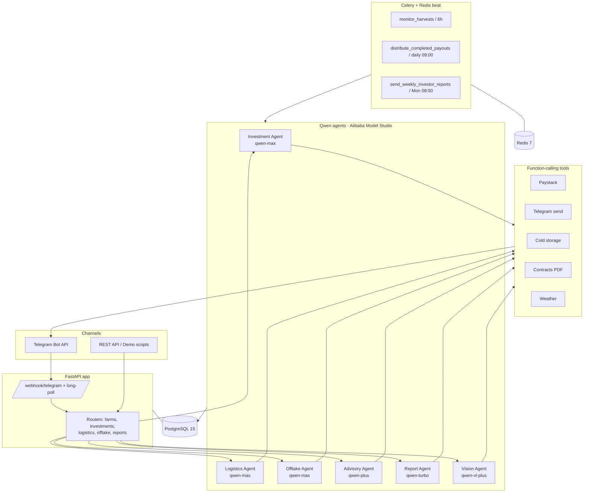

# Yieldra Architecture

> Invest in a farm. Let AI run it.

## System overview

## Autonomous flow

1. Investor pays via Paystack → **Investment Agent** verifies → creates `Investment` + `FarmPlot` → Telegram confirmation.
2. Farm reaches readiness → **Celery `monitor_harvests`** (every 6h) nudges farmers.
3. Farmer confirms in their language → **Logistics Agent** books cold storage + truck → notifies all parties.
4. **Offtake Agent** matches harvest to a buyer → generates contract PDF → both parties confirm.
5. Buyer pays → **Celery `distribute_completed_payouts`** (daily) → **Investment Agent** pays investors pro-rata.
6. **Report Agent** sends weekly portfolio updates (Celery, Mondays 08:00 WAT).

## Human-in-the-loop gates

| Gate | Rule |
|---|---|
| Investment re-confirm | Investments > ₦500,000 require explicit investor confirmation |
| Payout approval | Payouts > ₦100,000 held for investor Telegram `APPROVE` |
| Logistics booking | No truck/storage booked without farmer `READY` |
| Contract review | Contracts > ₦500,000 total: 48-hour review before signing |

## Money

All monetary values are stored in **kobo** (smallest Naira unit) in PostgreSQL and
converted to Naira only in responses (`app/utils/money.py`).

## Mock vs live

Every external tool runs in mock mode in development and switches to live calls once
real credentials are present (`settings.paystack_live`, `settings.telegram_live`).
The Qwen client always calls the real Model Studio endpoint. Inbound Telegram messages
arrive via long polling by default (no public URL needed); a `POST /webhook/telegram`
endpoint is also available for a real webhook on a public host.

> A rendered PNG export of this diagram belongs at `docs/architecture.png` for the
> Devpost submission.
