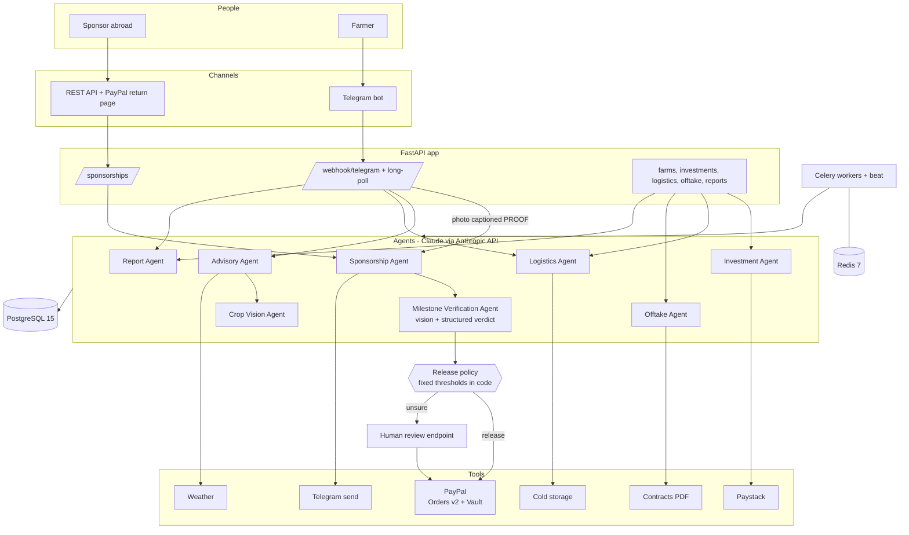

# Yieldra Architecture

> Sponsor a farm. Pay as it grows.

## System overview

## Sponsorship flow

1. `POST /sponsorships` → **Sponsorship Agent** plans four tranches for the farm's
   crop and creates a PayPal order for the first one, asking PayPal to save the
   sponsor's account on success.
2. Sponsor approves on PayPal → `GET /sponsorships/paypal/return` captures the order,
   stores the payment token, marks tranche 1 paid and opens stage 2.
3. Farmer sends a photo captioned `PROOF` → the photo is downloaded, fingerprinted
   and checked against earlier photos.
4. **Milestone Verification Agent** receives the photo and the stage's evidence
   requirement and must answer through a forced tool call:
   `shows_farm_scene`, `crop_matches`, `milestone_met`, `confidence`, `observations`,
   `concerns`.
5. **Release policy** (`decide`) turns the verdict into `release`, `review` or `reject`.
6. On `release` the tranche is charged to the saved PayPal account, committed, and
   the next stage opens. On the last tranche the saved account is deleted.

### Why the model cannot move money

The Milestone Verification Agent has no payment tool. It returns a verdict; plain
code compares it with `MILESTONE_RELEASE_CONFIDENCE` and `MILESTONE_REVIEW_CONFIDENCE`.
The photo's caption is never sent to the model, and the system prompt tells it to
treat writing inside a photo as scenery.

### Payment safety

| Concern | Mechanism |
|---|---|
| Retry or crash mid-charge | `PayPal-Request-Id` built from sponsorship reference + tranche + attempt |
| PayPal refused the charge | Tranche marked `payment_failed`; retry uses the next attempt number |
| No answer from PayPal | Tranche marked `payment_failed`; retry reuses the same key |
| Capture differs from the order | Sponsorship is not activated |
| Messaging or model failure after a charge | Charge is committed first; notifications never raise |
| Two photos at once | Open milestone rows are locked (`SELECT ... FOR UPDATE`) |

## Human-in-the-loop gates

| Gate | Rule |
|---|---|
| Milestone review | Verdicts between the review and release thresholds wait for a person |
| Investment re-confirm | Investments > ₦500,000 require explicit investor confirmation |
| Payout approval | Payouts > ₦100,000 held for investor Telegram `APPROVE` |
| Logistics booking | No truck/storage booked without farmer `READY` |
| Contract review | Contracts > ₦500,000 total: 48-hour review before signing |

## Other autonomous work

- **Celery `monitor_harvests`** (every 6h) nudges farmers of growing farms.
- **Logistics Agent** books cold storage and a truck once the farmer confirms.
- **Offtake Agent** matches a harvest to a buyer and generates the contract PDF.
- **Celery `distribute_completed_payouts`** (daily) pays naira investors pro-rata.
- **Report Agent** sends weekly portfolio updates (Mondays 08:00 WAT).

## Money

Amounts are integers in minor units: US cents for sponsorships
(`sponsorships.total_minor`, `sponsorship_milestones.amount_minor`) and kobo for the
naira tables. They are formatted only in responses (`app/utils/money.py`).

## Mock vs live

PayPal, Paystack and Telegram run in mock mode until real credentials are present
(`settings.paypal_live`, `settings.paystack_live`, `settings.telegram_live`). In mock
mode the PayPal approval link points straight at the return URL, so the whole flow
can be walked through locally. Model calls are never mocked: photo verification needs
a working `LLM_API_KEY`.
